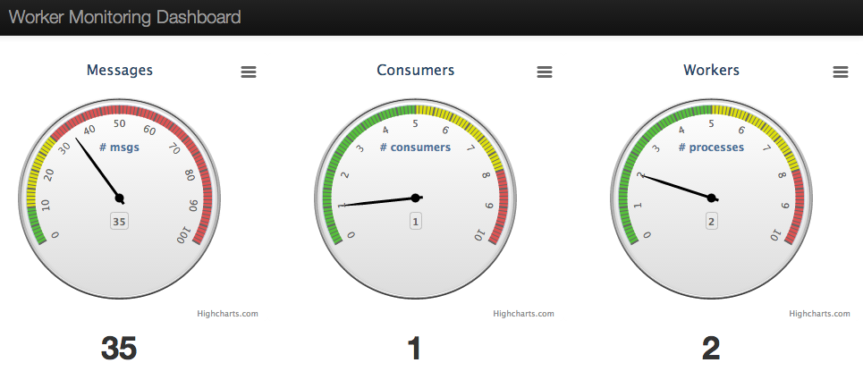

# Cloud Foundry Autoscaler

This project demonstrates the autoscaling of worker processes in a tradtional producer-consumer setting using RabbitMQ as the message queue. Workers are artifically throttled to create a queuing scenario.

## Running on Pivotal Web Services ##

This section will assume that you have a Pivotal Web Services account. If not, create one at http://console.run.pivotal.io/register.

### Building

The autoscaler component depends on the Cloud Foundry Java Client Library (https://github.com/cloudfoundry/cf-java-client/tree/master/cloudfoundry-client-lib). The cf-java-client currently depends on Spring 3.2. The cf-autoscaler applications are written using Spring 4.0. A branch of cf-java-client that works with Spring 4.0 has been created. First we'll need to build that from source.

1. `git clone git@github.com:cloudfoundry/cf-java-client.git`
1. `cd cf-java-client`
1. `git checkout spring4`
1. `mvn install` (You'll need a recent version of [Apache Maven](http://maven.apache.org/). You'll also need a [protocol buffer compiler](https://github.com/cloudfoundry/cf-java-client/issues/163).)

Now that we have this in our local Maven repository, we can build the cf-autoscaler components. Before building, we'll make some minor changes to the code:

* In your favorite editor, create the file `cf-autoscaler/autoscaler/src/main/resources/cf-security.yml`. Add the following contents, substituting your username and password for Pivotal Web Services:

    ```
    ---
    email: user@domain.com
    password: sup3rs3cur3
    ```
* Next, open the file `cf-autoscaler/autoscaler/src/main/resources/application.yml`. At the top of the file you'll find a set of properties labeled `cf`:

    ```
    ---
    cf:
      applicationName: worker-process
      target: http://api.run.pivotal.io
      org: jwatters-org
      space: autoscale
    ```

    Ensure that the `org` and `space` properties reflect the organization and space to which you're going to push the application.
* The Web UI depends on the [highcharts](http://www.highcharts.com) library which is free for non-commercial use. After cloning the repo you will need to download highcharts and copy the contents of the 'js' folder in the distribution to the 'cf-autoscaler/monitor/src/main/resources/static/assets/js/highcharts' directory.

    The app has been tested with Highcharts-3.0.5.

Now we're ready to build the component jars: 

1. `cd cf-autoscaler`
1. `./gradlew assemble` (The `gradlew` [Gradle](http://gradle.org) wrapper will download the appropriate version of Gradle and then build the project artifacts.)

### Deploying

The project includes a `manifest.yml` file that includes the necessary metadata to deploy the four components:

* **producer-process**: Produces text messages that are sent to a RabbitMQ exchange
* **worker-process**: Consumes text messages from a RabbitMQ queue that is bound to the producer's target exchange. The worker is artificially throttled to create the need for scaling.
* **autoscaler-process**: Monitors the queues, and based on configurable thresholds, will increase/decrease the number of **worker-process** instances via the Cloud Foundry API.
* **autoscale-monitor**: A web UI containing gauges for queue length, number of queue consumers, and number of **worker-process** instances.

It will also create and bind to these applications a RabbitMQ service provided by [CloudAMQP](http://www.cloudamqp.com/) via the Pivotal Web Services Marketplace. It uses the _Big Bunny_ plan, which is $99 per month, but represents the smallest plan that can provide the necessary connections for this demo (One connection each for the **producer-process** and **autoscaler-process**, plus _n_ connections for the **worker-process** instances. With the current throttling settings, instances usually cycle between one and six instances. By tweaking the settings, you may be able to get away with a _Tough Tiger_ plan at $19/month.). You can learn more about CloudAMQP plans [here](http://www.cloudamqp.com/plans.html).

Assuming you've installed the CF CLI, from the `cf-autoscaler` directory:

1. `cf api https://api.run.pivotal.io`
1. `cf login` (Provide your credentials and choose an appropriate organization and space. You'll need a memory quota of around 4 GB.)
1. `cf push`

This will deploy all of the components in the order shown above. You may notice one or more of the application instances failing and restarting. This is because the CloudAMQP is deploying a dedicated RabbitMQ cluster (assuming you stick with _Big Bunny_), and the applications may start before that provisioning is complete. Don't worry - everything will eventually converge to a working state in 1-2 minutes.

The web UI will be available at a URL with a random word appended to the hostname. You'll see it as the last output from the `cf push` command:

```
Push successful! App 'autoscale-monitor' available at autoscale-monitor-f2840.cfapps.io
```

You can visit this URL to see the gauges working:



Another useful way to monitor the application is via the CF CLI, which supports tailing of application logs via the Cloud Foundry [Loggregator](https://github.com/cloudfoundry/loggregator).

Example:

```
 cf logs autoscaler-process
Connected, tailing logs for app autoscaler-process in org jwatters-org / space autoscale as mstine@gopivotal.com...

2014-01-10T10:43:13.00-0600 [API]     OUT Created app with guid 0186722f-0843-4111-a96f-8d145195b276
2014-01-10T10:43:42.41-0600 [API]     OUT Updated app with guid 0186722f-0843-4111-a96f-8d145195b276 ({"console"=>true, "state"=>"STARTED"})
2014-01-10T10:53:24.73-0600 [App/0]   OUT 2014-01-10 16:53:24.730  INFO 31 --- [ask-scheduler-7] com.gopivotal.cf.autoscaling.Autoscaler  : { workers : 1}
2014-01-10T10:53:26.68-0600 [App/0]   OUT 2014-01-10 16:53:26.681  INFO 31 --- [ask-scheduler-7] com.gopivotal.cf.autoscaling.Autoscaler  : { workers : 1}
2014-01-10T10:53:27.29-0600 [App/0]   OUT 2014-01-10 16:53:27.292  INFO 31 --- [ask-scheduler-1] com.gopivotal.cf.autoscaling.Autoscaler  : { msgs : 53 consumers : 1}
2014-01-10T10:53:27.36-0600 [App/0]   OUT 2014-01-10 16:53:27.362  INFO 31 --- [ask-scheduler-6] com.gopivotal.cf.autoscaling.Autoscaler  : { msgs : 53 consumers : 1}
2014-01-10T10:53:29.36-0600 [App/0]   OUT 2014-01-10 16:53:29.360  INFO 31 --- [ask-scheduler-6] com.gopivotal.cf.autoscaling.Autoscaler  : { msgs : 54 consumers : 1}
2014-01-10T10:53:31.35-0600 [App/0]   OUT 2014-01-10 16:53:31.359  INFO 31 --- [ask-scheduler-6] com.gopivotal.cf.autoscaling.Autoscaler  : { msgs : 55 consumers : 1}
2014-01-10T10:53:32.14-0600 [App/0]   OUT 2014-01-10 16:53:32.146  INFO 31 --- [ask-scheduler-9] com.gopivotal.cf.autoscaling.Autoscaler  : { workers : 1}
2014-01-10T10:53:32.71-0600 [App/0]   OUT 2014-01-10 16:53:32.710  INFO 31 --- [ask-scheduler-9] com.gopivotal.cf.autoscaling.Autoscaler  : { workers : 2}
```
